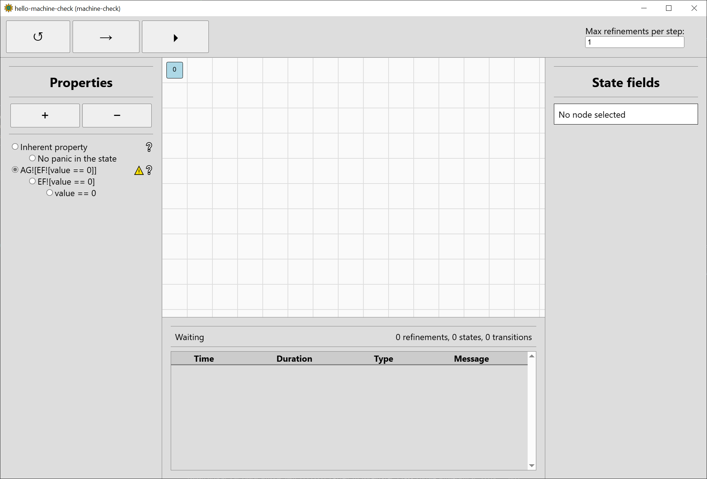
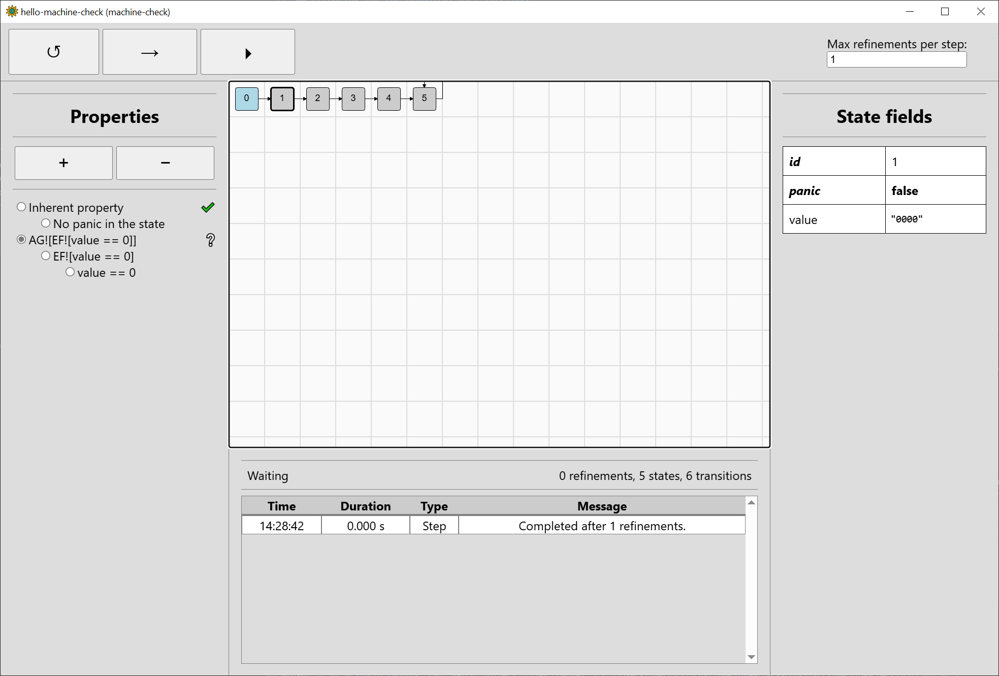
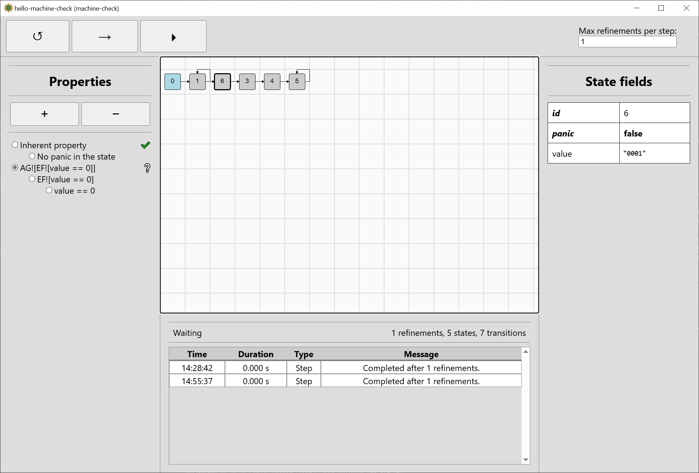
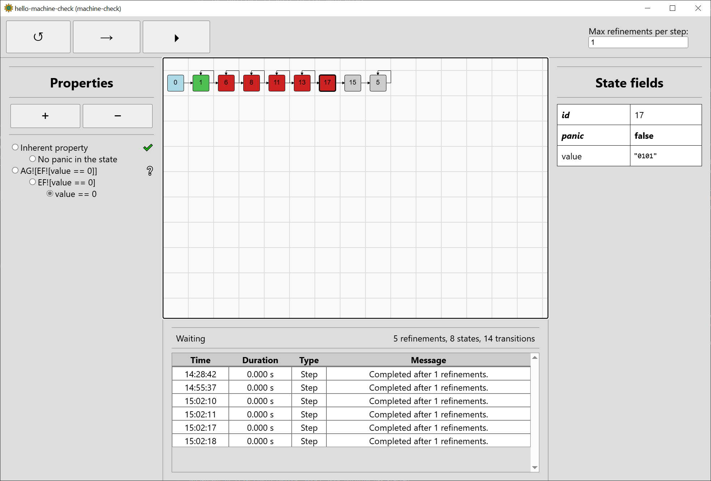
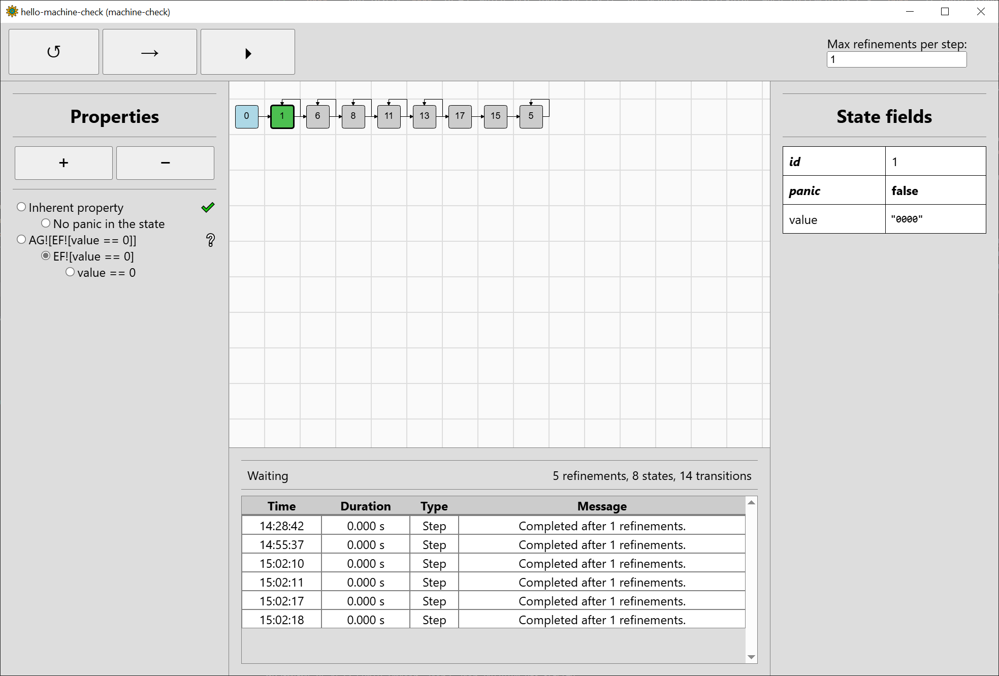
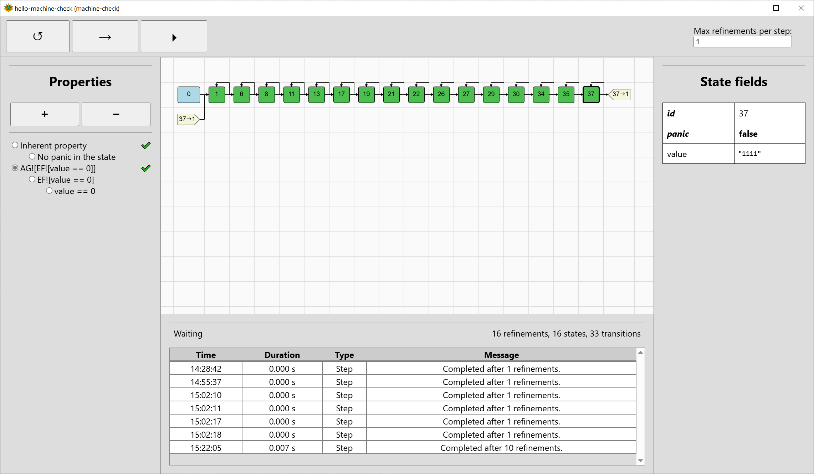
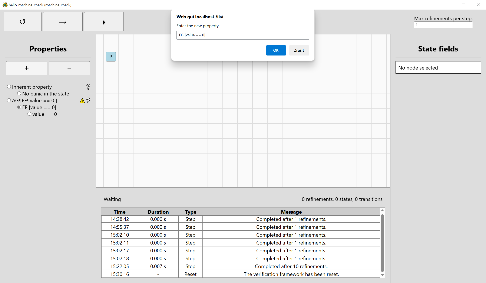
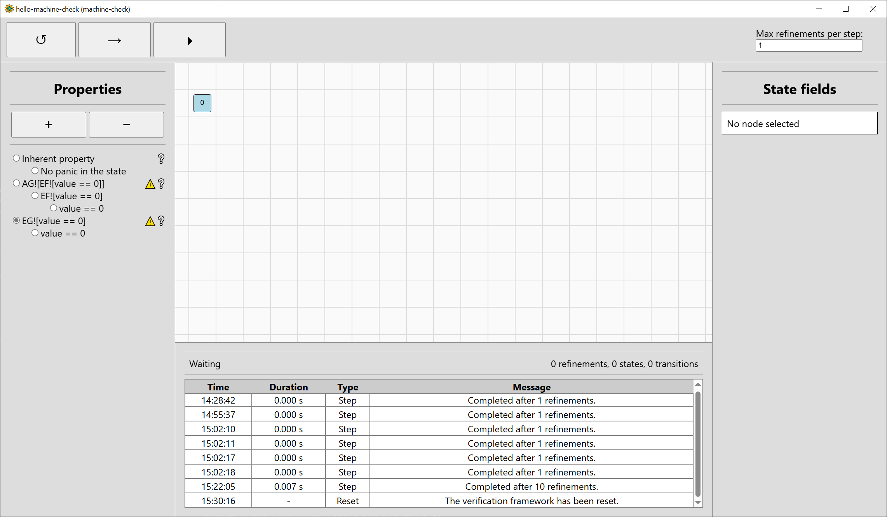
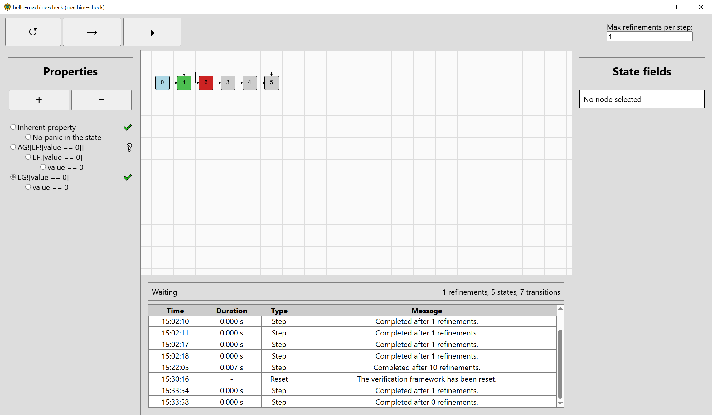
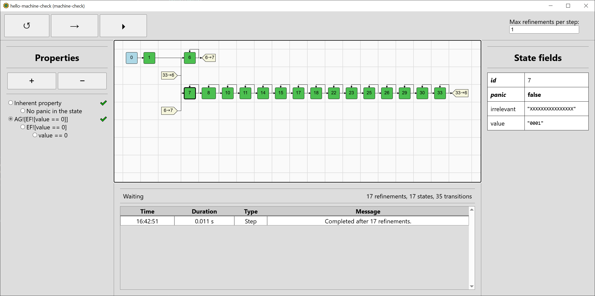

# Graphical User Interface

The **machine-check** GUI can be used to discover why the verification is taking too long or why the result does not match the expectations. As the GUI needs additional dependencies not available for all platforms and slows down compilation from scratch, it is disabled by default and must be enabled as a feature. Some dependencies may also need to be installed based on the operating system used.

## Preparing for the Graphical User Interface

As the GUI uses the [wry](https://github.com/tauri-apps/wry) and [tao](https://github.com/tauri-apps/tao) libraries for rendering that are a part of the [Tauri](https://tauri.app/) project, to be able to compile your crate with the **machine-check** GUI feature enabled, follow the [prerequisites](https://tauri.app/start/prerequisites/) for your operating system (Linux, macOS, or Windows). On up-to-date Windows 10 and 11 specifically, no additional dependencies are needed. For Linux and macOS, some tools and libraries might be needed so that the build does not fail.

Add the following to your Cargo.toml:

```toml
[features]
gui = ["machine-check/gui"]
```

You can now compile and run your system description crate with the GUI enabled, which would be done like this:
```console
$ cargo run --features gui -- --gui
```
The GUI will open prepared to verify the inherent property. You can also use `--property` to give a property for verification when the GUI opens.

## Visualising the Quickstart Example

Continuing with `hello-machine-check` from [Quickstart](./ch1_quickstart.md):

```console
$ cargo run --features gui -- --property "AG![EF![value == 0]]" --gui
(... compiling, building 272 crates ...)
   Compiling machine-check v0.4.0
   Compiling hello-machine-check v0.1.0 ((...)\hello-machine-check)
    Finished `dev` profile [unoptimized + debuginfo] target(s) in 47.60s
     Running `target\debug\hello-machine-check.exe --property "AG![EF![value == 0]]" --gui`
[2025-04-04T12:01:06Z INFO  machine_check_gui::backend::window] GUI window opened
```

A window like this should open:
<a href="../images/gui_1.png"></a>

The interface is split to five main areas:
 - The main state space visualisation area in the middle. In the above image, only the root node[^1] 0 is shown as verification did not start yet.
 - The top bar which controls verification, with three buttons to reset (&#x21BA;), step (&#x2192;), and run (&#x23F5;).
   The number of refinements to perform in each step can be controlled on the right side.
 - The left bar which manages the properties considered and shows their current verification results.
   The inherent property is always shown first. As we also gave the property `AG![EF![value == 0]]`, it is also shown.
 - The bottom bar which shows the current verification backend status (Waiting) and the number of refinements performed and states and transitions
   in the state space. Below that is a log of completed actions.
 - The right bar which shows the values of the fields of the selected state. Currently, no state is selected.

[^1]: All states are graph nodes. The root node is a part of the graph has the initial states as its direct successors, but is not a state itself.

So that we can discuss the progress of verification itself, click the step button (&#x2192;) once. You can also use keyboard navigation (Tab, Shift-Tab, Enter)
since the GUI is rendered as an HTML document. Five new states will be shown, click on the state with identifier 1 (#1 for short). If the main area is focused, 
you can also use your keyboard (the Home key selects the root node and arrows can be used to go between successive graph nodes or siblings). Right-clicking or 
middle-clicking the mouse allows you to drag the view of the main area.

The window should now look somewhat like this:
<a href="../images/gui_2.png"></a>

Recalling that our system from [Quickstart](./ch1_quickstart.md) had a single field `value` that was initialised to zero, we can see that #1 really
has value initialised to zero (displayed as `"0000"` in binary representation). There is no panic in this state, which is expected, since the example 
features no panics whatsoever.

The state after #1 should be incremented based on the the input `increment_value`. But there is only one successor, state #2. We can navigate to it 
to see that it has the value `"000X"`. This is *three-valued bit-vector abstraction*: the *abstract* state #2 can stand for either `"0000"` or `"0001"`. In
**machine-check**, it stands for at least one of them but not necessarily both. Moving to the next states, we can see that `value` changes to `"00XX"`,
`"0XXX"`, and lastly `XXXX` in #5, which just loops on itself. The behaviour is regular: when incrementing e.g. `00XX`, it could stand for `0011`, so we would
end up with `0100` after incrementing. However, it could also stand e.g. for `0010`, so we would end up with `0011` after incrementing. To ensure that the
verification is sound (never returns a wrong result), **machine-check** ensures the resulting state `0XXX` subsumes all of the possibilities. As it uses 
[a special algorithm](../under_the_hood/research.md) for this, the computation is faster than enumerating all the possibilities.

Even though the `value` is ultimately `XXXX`, no panic occurs when going from any state to the next one. Therefore, as seen in the left properties bar, the
inherent property holds. The warning sign previously seen to the right of the *recovery* property also disappeared: it informed us that as the inherent 
property had not yet been verified, the result of verifying the recovery property may be ultimately meaningless. (If you are unsure what a property 
verification icon to the right of the property means, you can read the title text after hovering over it with mouse.)

While the inherent property has been verified, the visualised state space is now too abstract to verify the property `AG![EF![value == 0]]`. As such,
**machine-check** will perform a *refinement* of the abstract state space, regenerate its affected parts, and verify again. Step the verification again:
<a href="../images/gui_3.png"></a>

**Machine-check** decided to refine the input going from #1 to #2. This added a loop from #1 to itself (when `increment_input` is 0) and generated a new state #6
that, upon inspection, has `value` equal to `0001` (when `increment_input` is 1). Unfortunately, potentially incrementing `0001` again goes to `00XX` represented
by #3, so we have not really progressed much.

Let's now talk more about the property bar. Step the verification four more times. While the property `AG![EF![value == 0]]` is still unknown (symbolised by 
the question mark to the right of the property), a nice aspect of [Computation Tree Logic](https://en.wikipedia.org/wiki/Computation_tree_logic) is that
we can compute whether the property holds or not from any state (i.e. considering the state is the sole initial state from which the property is computed),
and the temporal operators just combine this information from sub-properties. As such, we can visualise in which states each sub-property holds. Switch to
the sub-property `value == 0`:
<a href="../images/gui_4.png"></a>

We see that `value == 0` holds for the state #1 (`"0000"`), but does not hold for the states #6, #8, #11, #13, and #17 (`"0001"`, `"0010"`, ..., `"0101"`).
It is unknown whether it holds for #15 (`"01XX"`) or #5 (`"XXXX"`), as these may represent `0000` among others. We can switch to `EF![value == 0]` to 
see how we fare there:
<a href="../images/gui_5.png"></a>

In #1, we can clearly choose a sequence of inputs such that `value` is eventually 0, since `value` is already 0 in the state. In the other states,
we do not have enough information to say anything yet.

As we now have a good idea how things work, run the verification to the end. Note that the refinements will be chosen according to the property to which 
the chosen subproperty belongs to (it does not make sense to refine based on the subproperty, but it is nice to be able to visualise our standing for it).

The final state space is a bit longer than previously:
<a href="../images/gui_6.png"></a>

There is a before-unseen entity in the visualisation, graph references (light yellow) telling us about the the transition from #37 to #1. 
Since the state space graphs can be arbitrarily complex in general, only their spanning trees are drawn within the GUI visualisation, with references placed 
appropriately. Self-loops are an exception to the rule.

The property `AG![EF![value == 0]]` has been verified to hold, and you can inspect the subproperties to see if things match your intuition. Unfortunately,
in this case, refinement did not really help us much. To see something where it would help, reset the verification and use the button to add a new 
property (+) in the property bar. A dialog bar will pop up to enter a new property. You can also delete the selected non-inherent property by pressing
the remove-property button (-). Let's add a property `EG![value == 0]`, i.e. there exists a sequence of inputs
in which the value stays zero:
<a href="../images/gui_7.png"></a>

The property will be added to the end of the property bar, select it so it will be verified:
<a href="../images/gui_8.png"></a>

Step the verification twice, and the property will be verified. We only needed two refinements this time, and the final state space has just 5 states:
<a href="../images/gui_9.png"></a>


As we have seen, although the refinements used by **machine-check** can help, they can also make verification more complicated without a benefit. 
Fortunately, for complex systems such as machine-code systems, the benefits can be great. We can demonstrate that by making the input 32-bit, although
only the lowest-bit input will be used after masking, and also adding an irrelevant field loaded in the next function to the value of another input:
```rust
    #[derive(Clone, PartialEq, Eq, Hash, Debug)]
    pub struct Input {
        increment_value: Bitvector<32>,
        irrelevant_input: Bitvector<16>,
    }
(...)
    #[derive(Clone, PartialEq, Eq, Hash, Debug)]
    pub struct State {
        value: Bitvector<4>,
        irrelevant: Bitvector<16>,
    }
(...)
        fn init(&self, _input: &Input) -> State {
            State {
                value: Bitvector::<4>::new(0),
                irrelevant: Bitvector::<16>::new(0),
            }
        }

        fn next(&self, state: &State, input: &Input) -> State {
            let mut next_value = state.value;
            let increment_value_masked = input.increment_value & Bitvector::<32>::new(1);

            if increment_value_masked == Bitvector::<32>::new(1) {
                next_value = next_value + Bitvector::<4>::new(1);
            }

            State {
                value: next_value,
                irrelevant: input.irrelevant_input,
            }
        }
```

The state space has become only slightly larger due to the field `irrelevant` being zeroed after initialisation and being fully unknown afterwards:
<a href="../images/gui_10.png"></a>

>
> &#x26A0;&#xFE0F; The Graphical User Interface is completely new in **machine-check** 0.4, so there will be some wonkiness. 
> As with other parts of **machine-check**, further development is planned.
>
